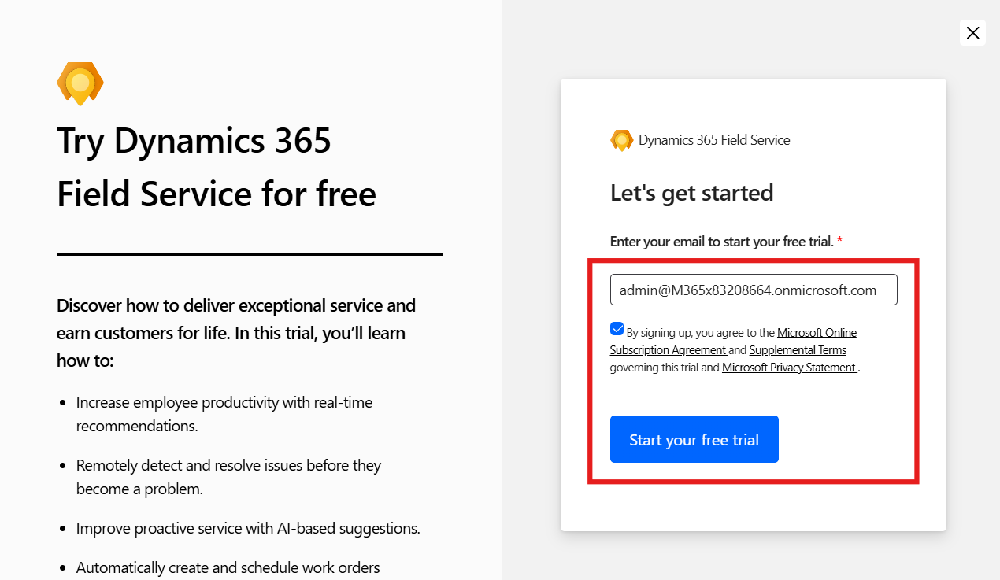
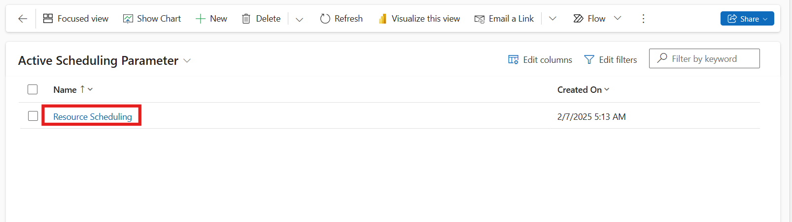
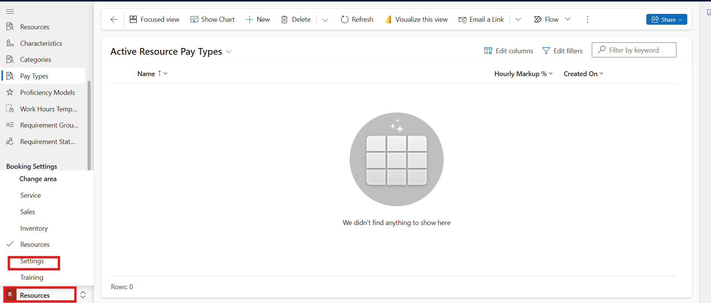
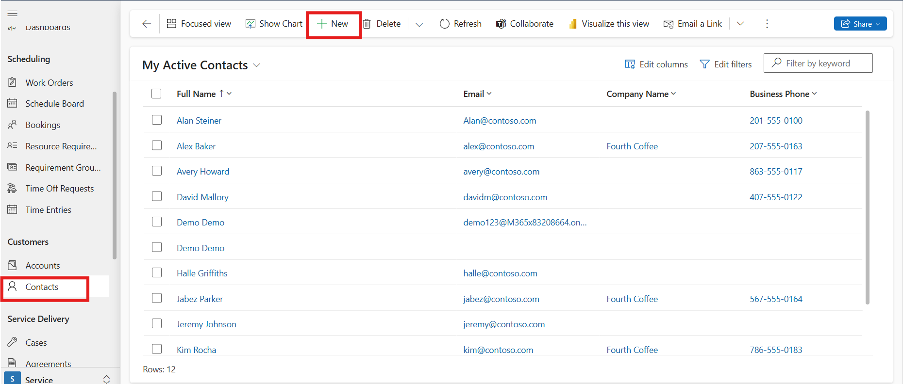
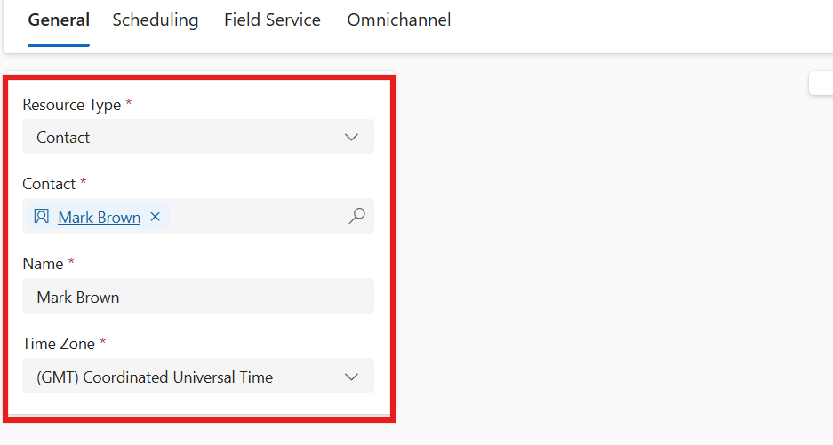
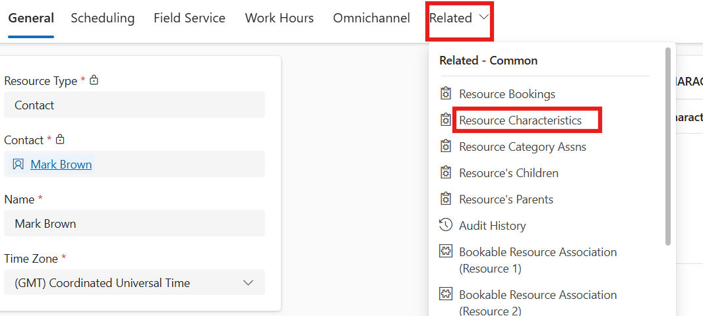
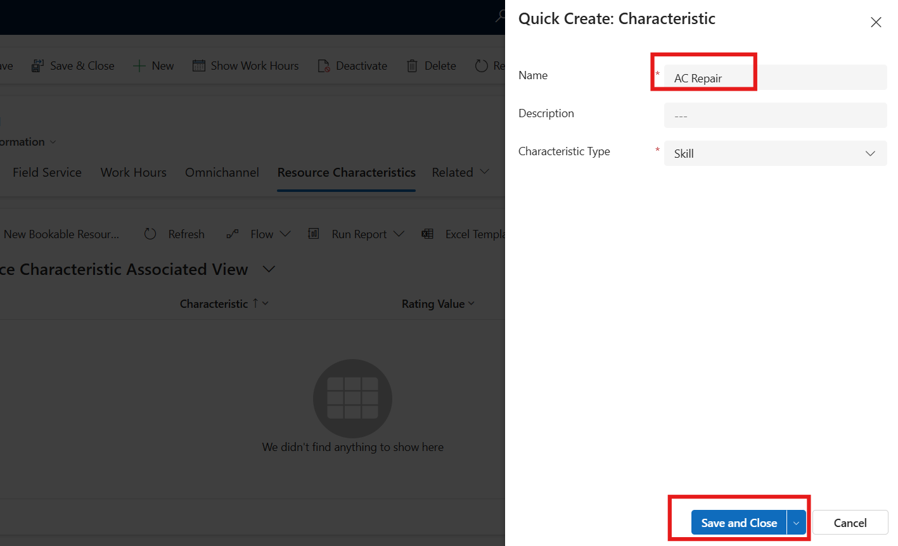

# Lab 1 – Configure Dynamic 365 Field Service

### Estimate Time: 45 mins

## Introduction

In this lab, you will configure **Microsoft Dynamics 365 Field
Service**, enabling efficient resource scheduling, work order
management, and service automation. You will begin by signing up for a
trial, configuring essential settings such as Bing Maps, resource
scheduling, and work order types. Additionally, you will create and
manage customer accounts, bookable resources, and install the **Field
Service Outlook Add-in with Copilot** to enhance productivity. By
completing this lab, you will gain hands-on experience in setting up and
managing **Field Service operations** within **Dynamics 365**.

## Exercise 1: Sign up in the Microsoft Field Service

1.  Open the Edge browser and navigate to **Microsoft Dynamics 365** by
    visiting +++https://www.microsoft.com/en-in/dynamics-365/+++

    

2.  On the middle of the screen click on the **Try for free.**

    

3.  Locate **Dynamics 365 Field Service** and click on the **"Try for
    free"** button.

    

4.  In the *Let's get started* screen, enter the **M365 tenant** that
    were provided to you -as part of your lab environment. Accept the
    license agreement. (If you are prompted to enter a phone number, you
    can enter 0123456789.)

5.  Select **Start your free trial**. (If prompted, select **Launch
    Trial** in the pop-up.)

    

6.  Enter the **M365 password** in the password field and
    click on the **Sign in** button. Your trial will launch. It may take
    a few minutes for your environment to open.

    

7.  Click on the **Cross** icon to close the what’s new window.

    

## Exercise 2 - Configure Dynamics 365 Field Service

### Task 1 - Enable Bing Maps to use with Resource Scheduling

1.  In the Dynamics 365 Field Service app, click the **Service** from
    the bottom-left of the sitemap and select **Resource** to change the
    area, and under the **Administration** group select **Scheduling
    Parameters**.

     

     

2.  Click on the **Resource Scheduling** record.

     

3.  Locate the **Connect to Maps** field. This should be set to **Yes**.

4.  If Connect to Maps is set to No, set it to **Yes** and
    click **OK** from the popup.

5.  Click **Save and Close**.

     

### Task 2 – Configure the Categories

1.  Click on the **Categories** under **Resources** and then click on
    the **+ New** button from top bar.

    

2.  In the name field, enter +++**Air Conditioner Service**+++ in the field.
    Click on the **Save and Close** button from top bar.

    

### Task 3 – Configure the Work Order Type

1.  Click on the **Resource** from the bottom left corner and select **Setting**
    area.

    

2.  In the Field service setting area, click on the **Work Order Type**,
    then click on the **+ New.**

    

3.  In the Name field enter +++**AC Repair and Maintenance**+++ and then click
    on the **Save and close.**

    

### Task 5 – Configure the Incident Type 

1.  In the Field service setting area, click on the **Incident Types**
    and then click on the **+ New.**

    

2.  In the Name field enter +++**Cooling Issue**+++

    

3.  Click on the **Detail**, In **Estimate Duration Field** and select
    **2 hours.**

    

4.  From the top bar click on the **Save and Close**.

    

### Task 6 - Enable an entity for scheduling

1.  Click on the **Field service app** and select the **Resource scheduling**
    app.

     

     

2.  In Resource Scheduling, from bottom left corner, change area as
    **Settings area**. Under **Scheduling**, select **Administration**.
    Select **Enable Resource Scheduling for Entities.**

     

     

3.  In the **Enable New Entity** section, under Add Entity, Enter
    +++**Contact**+++ in the field and select **Contact** from the result.

     

4.  Click on the **Book Relationship** and **Requirement Relationship**
    fields and select **Create New Relationship.**

    

5.  Select **Publish** **Customization**.

     

## Exercise 3 - Create and Manage Customer Accounts

1.  Click on the **Resource Scheduling app** from top and select **Field Service app** from the app option.

     

     

2.  In Field Service, under **Customers**, select **Accounts**, and then
    select **+New**.

    

3.  Enter the **Account Name** as +++**Contoso Retail**+++ in the field.

     

4.  Click on the Servicing, click on Price List section, press enter and select **Default USD**

    

5.  Select **Geo Code** at the top of the form.

     

6.  Click on the **Pencil icon** next to address and enter +++**Stratton Common**+++ in the Street 1 field.

7.  In **City** Field Enter +++**Fremont**+++

8.  In the **State/Province** field enter +++**CA**+++

9.  In **Zip/Post Code** field enter +++**34567**+++

10. In the **Country/region** field enter +++**United States**+++

11. After entering address click on the **Done** button.

    

    

12. Click on the **OK** button to configure the Geocode Address.

    

13. Click on the **Save and Close** to complete the process.

    

14. Click on the **Contoso Retail** check box, then click on the
    **Activate** button form top bar. Again, click on the **Activate**
    button.

    

    

## Exercise 4 - Create a work order

1.  In the Scheduling section, select **Work Orders** and then
    select **New**.

     

2.  At a minimum, enter information in the following required fields.

    1.  **Status** – Select Unscheduled

    2.  **Priority** – Select Normal

    3.  **Service Account** – Click on the Service account field. Enter
        +++**Contoso Retail**+++ in the field and select the result.

    4.  **Work order type** - Click on the Work order type field. Enter
        +++**AC Repair and Maintenance**+++ in the field and select the
        result.

    5.  **Incident type** - Click on the Incident type field. Enter
        +++**Cooling Issue**+++ in the field and select the result.

    6.  **Agreement** - Click on the Agreement field. Press enter and
        select the +++**sample agreement**+++ from the result.

3.  Select **Save and close** from top.

     

## Exercise 5 – Create Contact and Setup Bookable Resource

### Task 1 – Create Contact in Microsoft Field Service

1.  In the Service area, click on the **Contacts** and then click on **+ New.**

    

2.  Enter the given below details in the respected fields:

    1.  Click on the First Name field and enter +++**Mark**+++ as name.

    2.  Click on the Last Name Field and enter +++**Brown**+++ as last name.

    3.  Click on the Job title field and enter +++**Field Engineer**+++ in the
        field.

    4.  Click on the Account name field and enter +++**Contoso Retail**+++ in
        the field and select the appearing result.

     

3.  Click on the **Save and close** button from the top bar.

    

### Task 2 - Create other bookable resources

1.  In Field Service, change to the **Resources** area from bottom left
    side and go to **Resource** --> **Resources** and select **New**.

     

     

2.  In the Resource type field, select **Contact**. In the Contact Field
    select **Mark Brown**. In the time zone field, select **(GMT) Coordinate Universal Type.**

    

3.  Click on the **Save and Close** from the top bar.

    

### Task 3 – Configure the Working Hours

1.  Go to **Resource** --> **Resources** and open Mark Brown resource. In
    Mark brown resource click on the **Work Hours.**

     

     

2.  Click on the Working hour on the calendar and then select **Edit --> All events in the series.**

    

3.  On the weekdays, deselect the **Sunday and Saturday**. Set start
    time as **10 AM** and End time as **06 PM** and then click on the **Save**
    button.

4.  Click on the **OK** button on the popup window.

    > Note: The start and end time will set automatically according to the
    universal time.

    

    

5.  Click on the **Save and Close** button from the top bar.

    

### Task 4 - Add characteristics, and categories

1.  Click on the **Resource** under Resources and click on the **Mark Brown** source.

    

2.  Click on the **Related** option and select **Resource Characteristics.**

    

3.  Click on the **+ New Bookable** Resources.

    

4.  Click on the Skill Name field and select **+ New Characteristics**.

    

5.  In the Name filed enter +++**AC Repair**+++, then click on the **Save and Close.**

    

6.  Again, click on the **Save and Close** button.

    

7.  Select **Related** --> **Resource Category Assns**.

    

8.  Select **New Resource Category Assns**.

     

9.  Select **Air Conditioner Service** Category from the lookup. Click
    on the **Save** and then **back** button.

     

10. Again, click on the **Save and Close** from the top bar.

    

## Exercise 6 – Enable Work order summary report

1.  Navigate back to **Service** **area** in field service. Click on the
    **service** form the bottom left corner and select **Settings**
    area.

2.  A Field Service administrator must **enable** the report in 
    **Analytics and Insight** \> **Settings** \> **Field Service
    historical analytics** \> **Manage**. After enabling click on the
    **Save and Close.**

3.  Navigate back to **service** **area** of field service, and click on
    the **Reports** under Analytics and Insights. It takes up to **24
    hours to setup**. Proceed with next exercise while its creating.

##  Exercise 7 - Install Field Service Outlook Add-in with Copilot 

### Task 1 – Login Into Microsoft Admin Portal

1.  Open the Edge browser and navigate to **Microsoft Admin Portal** by
    visiting +++admin.microsoft.com+++

2.  Enter the **M365 Admin tenant ID** in the Email field and click on the
    **Next** button.

    

3.  Enter **Password** in the field and click on the **Sign In** button.

    

### Task 2 – Install Field Service Outlook Add-in with Copilot

1.  under **Settings,** click on **Integrated apps**.  

     

2.  Scroll down, click on **Get apps.**

      

3.  In the search box, enter +++**Field service**+++ and then click on **Get it now** under **Dynamics 365 Field Service for Outlook,** and again
    click on **Get it now** to confirm your information.  

     

     

 

4.  You will be navigated to **Microsoft Admin center--> Integrated Apps**. On the **Assign users** page, select 
    **Entire organization** and then select **Next**. 

     

5.  On the **Accept permission requests** page, select **Accept permissions** and re-login on popup window.

     

6.  Sign in with your **Office 365 admin tenant** credentials on the pop-up window. 

     

7.  Select **Next** on the **Accept permission requests** page. 

     

8.  On the **Review and finish deployment** page, select **Finish
    deployment**. 

     

9.  Select **Done** once the deployment is completed. It can take up to six hours for the app to appear in Outlook.

     

## Conclusion

By completing this lab, you have successfully configured Microsoft
Dynamics 365 Field Service for efficient scheduling and resource
management. You have learned how to enable Bing Maps, create work
orders, set up customer accounts, configure bookable resources, and
install the Field Service Outlook Add-in with Copilot. These
configurations enhance service delivery, streamline operations, and
improve customer interactions. You are now equipped with the
foundational skills needed to manage Field Service deployments
effectively.
