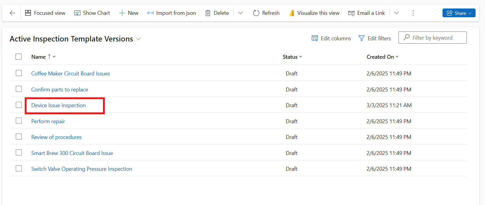

# Lab 2 - Create an Inspection and add it to a work order

**Estimate Time: 25 mins**

## Introduction

In this lab, you will learn how to create and manage inspections for
work orders in Contoso Retail using Microsoft Dynamics 365 Field
Service. You will sign in to a trial environment, create an inspection
template, associate it with a service task type, and link it to a work
order. This process ensures that work orders include structured
inspections, improving service quality and operational efficiency.

## Exercise 1 – Sign In Microsoft Dynamic 365 Field Service

**Note:** If you already sign in field service and start free trial. Please skip the exercise 1 and start executing from exercise 2.

1.  Open the Edge browser and navigate to **Microsoft Dynamics 365** by
    visiting +++https://www.microsoft.com/en-in/dynamics-365/+++

    

2.  On the middle of the screen click on the **Try for free.**

    

3.  Locate **Dynamics 365 Field Service** and click on the **"Try for free"** button.

    

4.  In the **Let's get started** screen, enter the M365 tenant that were
    provided to you -as part of your lab environment. Accept the license
    agreement. (If you are prompted to enter a phone number, you can
    enter 0123456789.)

5.  Select **Start your free trial**. (If prompted, select **Launch
    Trial** in the pop-up.)

    

6.  If prompted enter the **M365 password** in the password field and
    click on the **Sign in** button. Your trial will launch. It may take
    a few minutes for your environment to open.

    

7.  Click on the **Cross** icon to close the what’s new window.

    

## Exercise 2 - Create inspection

1.  From the bottom left corner click on the **Service** area and select
    **Setting** area.

    

2.  Go to **Work Orders --> Inspection Templates** and select **+**
    **New**.

    

3.  Name the template +++**Device Issue Inspection**+++ and add a brief
    description as +++**This inspection ensures all critical functionalities of the AC are working as expected**+++

    

4.  In the Toolbox, add questions related to appliance inspection:

    1.  **Checkbox Question:**

        1.  Select **Checkbox** from the toolbox.

        2.  Enter the question: +++Is your AC not working due to a
            power supply issue?+++

        3.  i.	Enter options: Edit the first option Item 1 to **Yes**, second option Item 2 to **No** (Delete any extra options).

     

2.  **Dropdown Question:**

    1.  Select Dropdown from the toolbox.

    2.  Enter the question: +++Which issue have you noticed with your AC?+++

    3.  Enter options: +++A) Weak airflow+++, +++B) Unusual noises+++, +++C) Bad Odors+++, +++D) Frequent cycling+++

     

3.  **Number Question:**

    1.  Select **Number** from the toolbox.

    2.  Enter the question: +++How often should an AC unit be servicesd?+++

     

5.  Click on the **Preview** to see the appearance of the template.

    

6.  Click on the **Save and Close** from the top bar.

    

7.  Click on the **Device Issue Inspection and** Click on the **Publish and generate** from top bar and again click on the **Publish**.

    

    

    

8.  Click on the **Save and Close** from the top bar.

    

## Exercise 3 - Associate the Inspection to a Service Task Type 

1. In **Settings**, select **Service Task Types** under work order.Click on th **New** from top bar.

    

2. Turn on the **Has inspection**, In the nam,e field enter **Device Issue Inspection** . In Estimated Duration field select **2 hours**.

    
 

3.  Click on the **Save & Close** to save the service task type.

     

## Exercise 4 - Add the Inspection to a Work Order

1.  Click on the **Setting** change area and select **Service** area.

     

2.  Click on the **Work Order** under scheduling and Select the **Work Order Number** which we create in Lab 1.

     

3.  Navigate to the **Tasks** section and select **Add Task**.

     

4.  Choose **Device Issue Inspection** as the task type.

5.  Click on the **Tick mark** to **Save** **and Close** the Service
    task.

     

6.  Click on the **Save and Close** to save the work order.

     

## Conclusion

By completing this lab, you have successfully created an inspection
template, associated it with a service task, and linked it to a work
order. These steps enhance the accuracy and efficiency of service
operations, ensuring that work orders include necessary inspections for
quality assurance.
