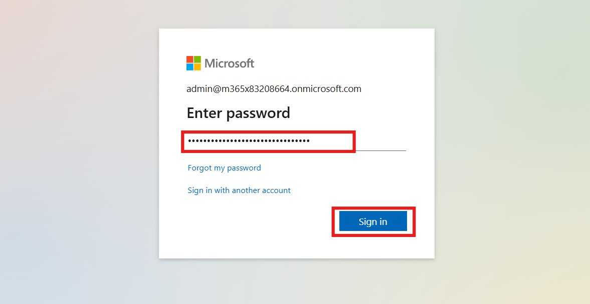
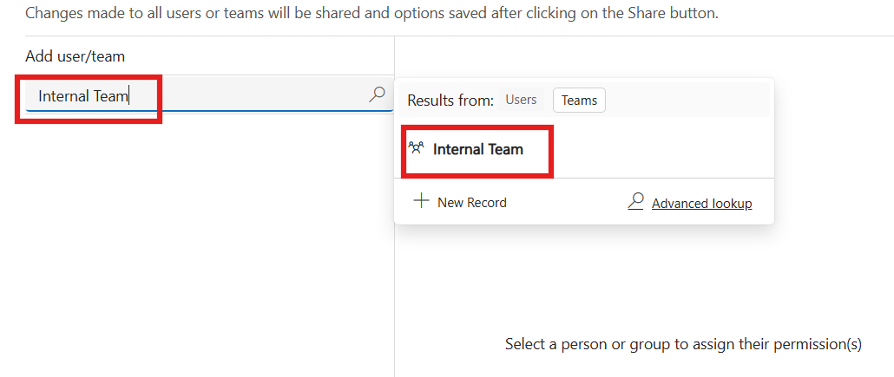
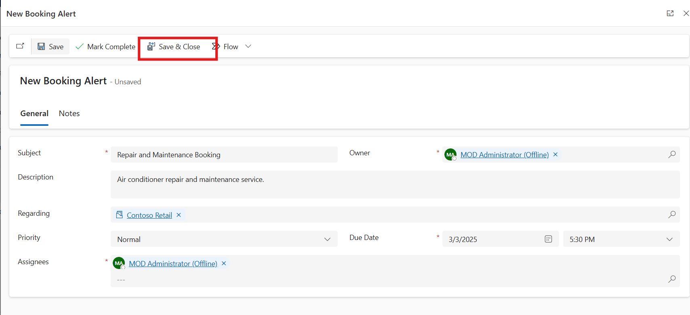
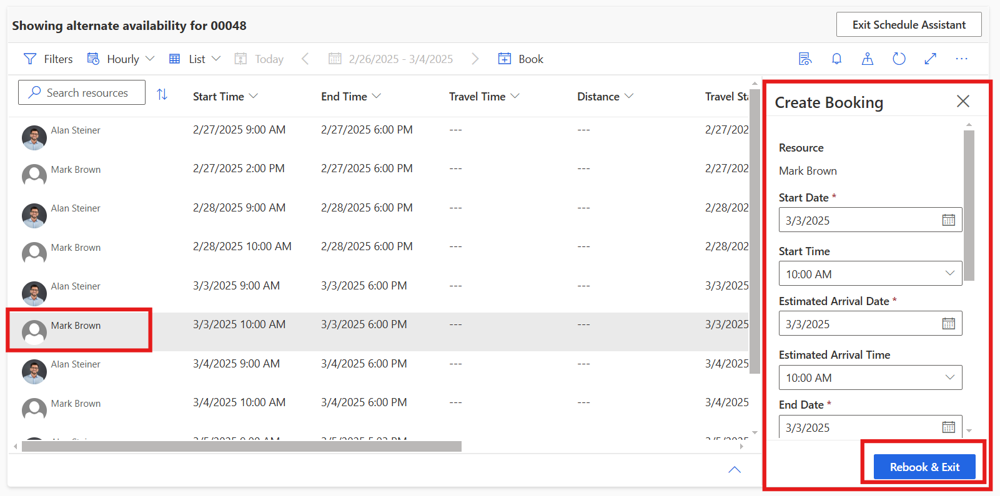

# Lab 3 - Universal Resource Scheduling for Dynamics 365 Field Service

**Estimate Time: 25 mins**

Introduction  
This lab focuses on Universal Resource Scheduling within Dynamics 365
Field Service, helping you efficiently manage resources, schedules, and
bookings. You will learn how to log into the Microsoft Fabric portal,
configure board settings, share schedule boards, create booking alerts,
and use the schedule assistant. By completing this lab, you will gain
hands-on experience in optimizing field service operations using
Dynamics 365.

## Exercise 1 – Login Into Microsoft Fabric Portal

1.  Open the Edge browser and navigate to **Microsoft Dynamics 365** by
    visiting +++https://www.microsoft.com/en-in/dynamics-365/+++

    

2.  On the middle of the screen click on the **Try for free.**

    

3.  Locate **Dynamics 365 Field Service** and click on the **"Try for free"** button.

    

4.  In the **Let's get started** screen, enter the M365 tenant that were
    provided to you -as part of your lab environment. Accept the license
    agreement. (If you are prompted to enter a phone number, you can
    enter 0123456789.)

5.  Select **Start your free trial**. (If prompted, select **Launch
    Trial** in the pop-up.)

    

6.  If prompted enter the **M365 password** in the password field and
    click on the **Sign in** button. Your trial will launch. It may take
    a few minutes for your environment to open.

    

7.  Click on the **Cross** icon to close the what’s new window.

    

## Exercise 2 – Board view settings 

1.  Click on the **Field Service** app from the top bar to navigate into
    Microsoft Dynamic 365 apps.

    

2.  Click on the **Resource Scheduling** app from the dynamic 365 apps.

    

3.  Click on the **Schedule Board** then click on the horizontal
    ellipsis from the right side and select **Scheduler settings**.

    

4.  Verify or change the setting fields as given below information

    | Setting                                  | Value                   |
    |------------------------------------------|-------------------------|
    | Time zone                                | (GMT) Coordinate Universal Time |
    | Work Time                                | 10 AM to 06 PM          |
    | Working Days                             | Monday to Friday        |
    | Time Resolution                          | 15 minutes              |
    | Row height                               | Custom                  |
    | Show Canceled                            | On                      |
    | Apply territory filter to requirements   | Off                     |
    | Show travel duration                     | On                      |

    

## Exercise 3 – All board settings

1.  Select the vertical ellipsis ⋮ next to the schedule board tab name
    and choose **Board settings**.

    

2.  Board settings have multiple option to change the appearance and
    setting. For this lab we are using the default setting. Click on the
    **Cancel** button.

    

    

## Exercise 4 - Share a schedule board tab with specific people

1.  Go to **Settings** \> **Advanced Settings** from the top bar.

    

2.  Click on the **Advanced Find** option form the top bar, it will
    popup dynamic 365 advanced find window.

    

3.  In the pop-up window, click on the **Look For** field and select
    the **Schedule Board Settings** table then click on the **Results**.
    It shows the list of records shows all schedule board tab records
    you have access to.

    

4.  Click on the initial public view from the tables it will pop up new
    window which show the scheduler, then click on the **OK** on the pop
    window.

    

    

5.  Click on the **Share** option from the top right side and then
    select **Manage access**.

    

6.  Click on the **Add user team** field and Click on the **New Record**
    and then select **Team**. Click on the **Ok** button on the Leave
    this page popup.

    

    

    

7.  In the Team name field enter +++**Internal Team**+++.

8.  Click on the **Business Unit** field, press enter key and select the
    default business unit.

    

9.  Click on the Administrator field and enter **MOD Administrator** in
    the field. Select the **MOD Administrator** option.

    

10. Click on the **Save** button and then click on the **Go back**
    button.

    

11. Click on the **OK** on the pop window.

    

12. Again, click on the **Share** button and select **Manage**
    **access**.

    

13. Click on **Add user/team field** and enter **Internal Team** in the
    field. Select **Internal Team** from the result.

    

14. Click on the **Internal Team** from the manage access section and
    Select all-permission check box. Click on the **Share** button.

    

15. Close **initial public view board** and **Advanced Find** Window.

    

    

## Exercise 5 - Create a booking alert

1.  Click on the **Power Platform Environment** Setting app and select
    Resource Scheduler App.

    

    

2.  Click on the **Schedule board** under Tools section and select
    **initial public view** **Board**.

    

3.  Select the **Booking Alerts** icon and select **New Booking Alert**.

    

4.  Enter or select the given below information in the given field.

    | Subject      | +++Repair and Maintenance Booking+++               |
    |-------------|---------------------------------------------|
    | Description | +++Air conditioner repair and maintenance service.+++ |
    | Regarding   | +++Contoso Retail+++                              |
    | Priority    | Normal                                     |
    | Due Date    | Any future date                            |
    | Due Time    | Select time                                |
    | Assignees   | Mod Administrator                         |

    

5.  Select **Save & Close**.

    

6.  When the due date is reached, the alert appears on the **Booking
    Alerts** side pane on the schedule board. Assignees can view or
    snooze the active alert. Assignees can set the snooze time.
    Assignees can dismiss all alerts.

    

## Exercise 6 - Configure the schedule assistant

1.  From Open Requirements section, placed at bottom side. Click on the
    Vertical ellipsis of Work order Name which we create in Lab 1 and
    then click on **Find Availability** .

    

2.  Click on the Mark Brown resource, the create Booking window will
    open. Select Start date, Start Time, Estimate Arrival Date, Estimate
    Arrival Time, End Date, End time, booking Status. Click on the
    **Book and Exit**.

    

3.  Click on the down arrow on resource section and Right-click on
    the Work order under **Mark Brown** and select **Rebook**.

    

4.  Click on the resource the create Booking window will
    open. Reselect Start date, Start Time, Estimate Arrival Date,
    Estimate Arrival Time, End Date, End time, booking Status. Click on
    the **Rebook and Exit**.

    

## Conclusion

By completing this lab, you have successfully explored key features of
Universal Resource Scheduling in Dynamics 365 Field Service. You have
learned how to manage schedule boards, share resources, configure
booking alerts, and utilize the schedule assistant for efficient
workforce management. These skills will help you streamline scheduling
operations and improve service delivery within your organization.
