# Lab 5 - Create a work order and draft an email response with Copilot in Field Service Outlook add-in

**Estimated time: 30 mins**

**Introduction:**  
This lab guide walks you through the process of creating and managing
work orders using the Field Service Outlook add-in and Microsoft
Copilot. You will learn how to generate a work order by sending an
email, sign into the Field Service add-in, and leverage Copilot to
automate work order creation. Additionally, the lab covers manual work
order creation, drafting email responses with Copilot, and scheduling or
rescheduling work orders. By completing these exercises, you will gain
hands-on experience in streamlining work order management within
Outlook, improving efficiency in field service operations.

## Exercise 1 – Get started with the add-in

### Task 1: Send an email to create work order

1.  Navigate to outlook by visiting
    +++https://www.microsoft.com/en-us/microsoft-365/outlook/log-in+++ and
    then click on the **Sign in**.

> 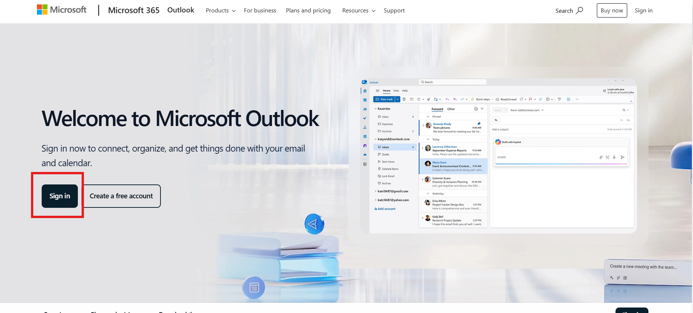

2.  Enter personal email id in the email field and click on the **Next**
    button.

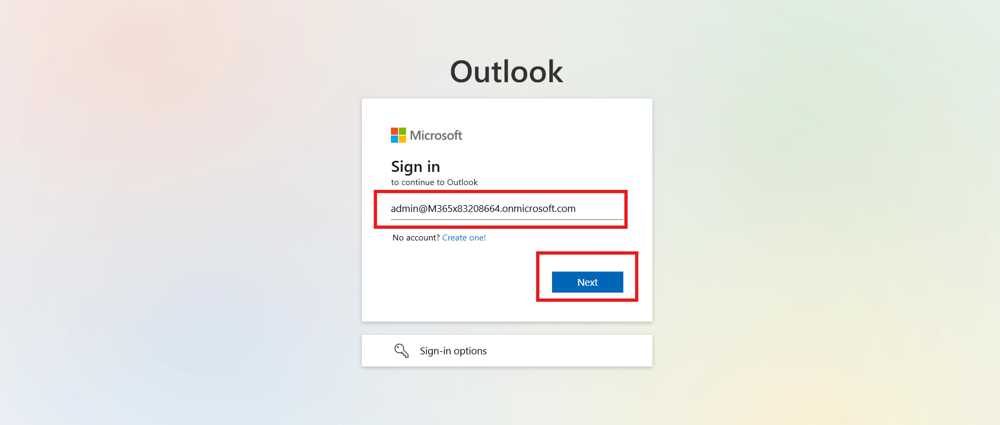

3.  Enter Password in the field and click on the **Sign in** button.

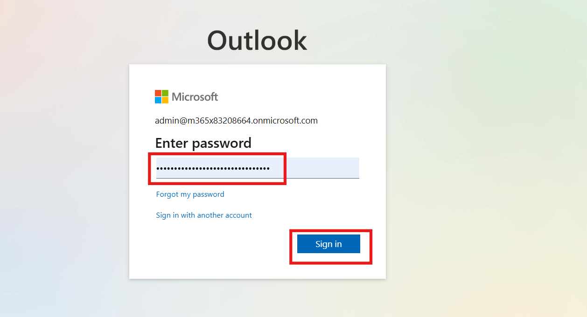

4.  To stay signed in click on the **Yes** button.

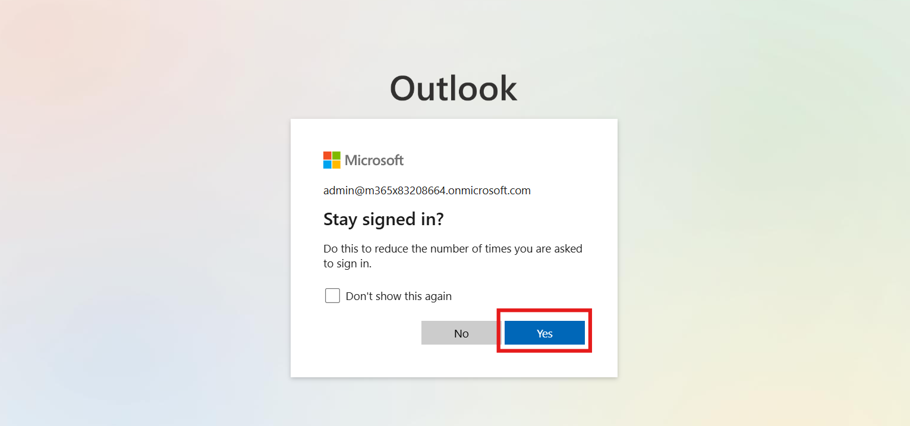

5.  Click on the **New email** and draft a mail as given below and send the
    mail. After sending mail sign out from the outlook.

    | Field   | Value  |
    |---------|--------|
    | **To**  | +++Enter admin tenant ID in the field+++ |
    | **Subject** | +++Work Order Scheduling – AC Repair and Maintenance |
    | **Body** | +++Hi,   I hope you are doing well. We would like to schedule a work order with the following details:   • **Priority:** Normal   • **Service Account:** Contoso Retail   • **Work Order Type:** AC Repair and Maintenance   • **Incident Type:** Cooling Issue   Looking forward to your confirmation.    Best regards+++ |

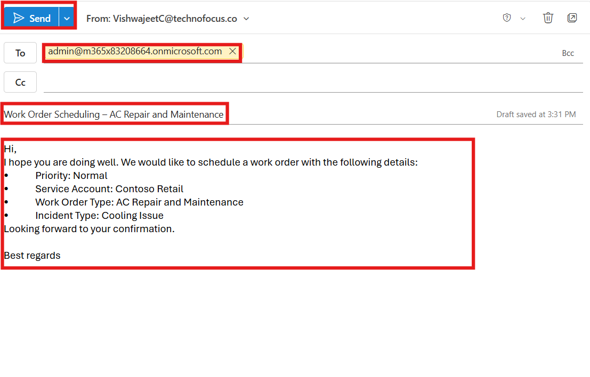

### Task 2 – Sign-in to your environment

1.  Navigate to outlook by visiting
    +++https://www.microsoft.com/en-us/microsoft-365/outlook/log-in+++ and
    then click on the **Sign in**.

> 

2.  Enter M365 admin tenant in the email field and click on the **Next**
    button.

3.  Enter Password in the field and click on the** Sign in** button.

4.  To stay signed in click on the **Yes** button.

5.  Open an email or view it in the Reading Pane, select **apps** then and
    then select **Field Service**.

6.  If required, select **Sign in to get started**. And enter M365 admin
    tenant for the sign in.

> 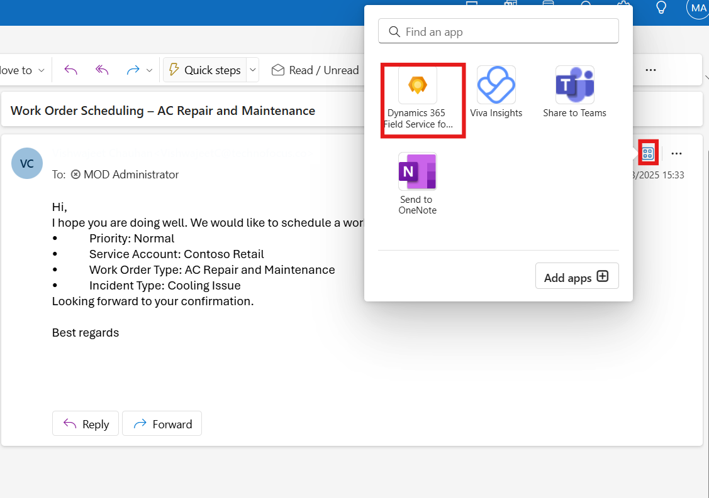

7.  To see the version number and session ID. Open the **Field Service add-in** and select the ellipsis (**…**).

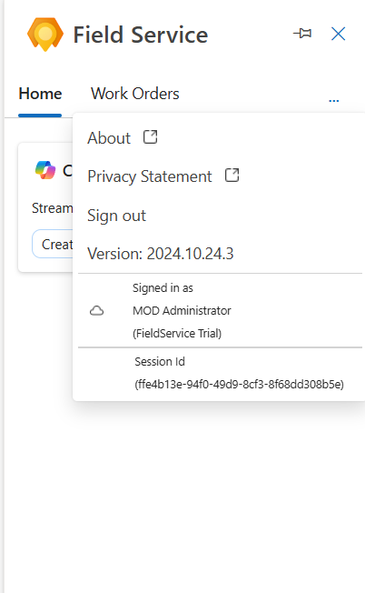

## Exercise 2 - Create a work order with Copilot

1.  In field service outlook home section under copilot, click on the
    **Create a work order from email.**

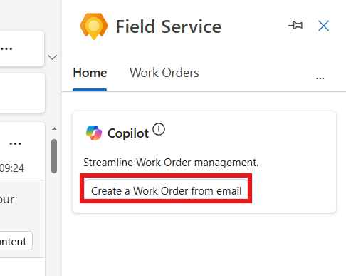

2.  Check the required information available in the field.

    - Priority - Normal

    - Service Account – Contoso Retail

    - Work Order Type – AC Repair and Maintenance

    - Incident type – Colling Issue

> 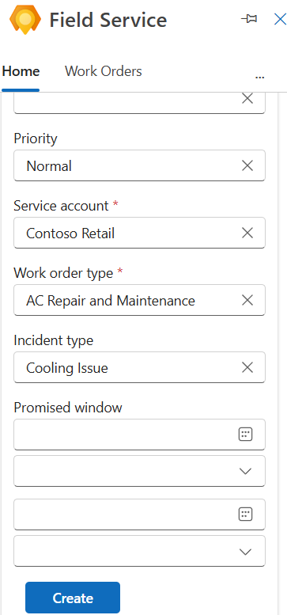

3.  Click on the **Create** button to create work order.

> 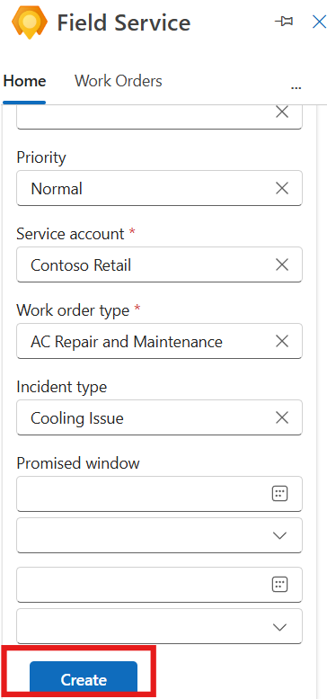

## Exercise 3 - Create a work order manually

1.  While you're viewing an email, open the Field Service **add-in**, and
    then select the **Work orders** tab.

> 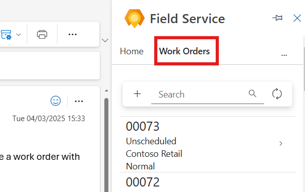

2.  Select the **Create work order (+)** button.

> 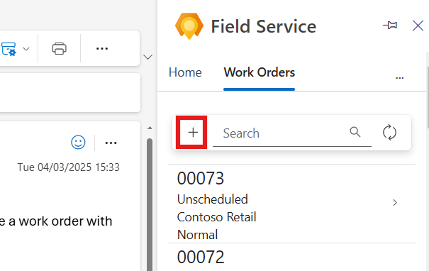

3.  Fill in the required information.

    - Priority - High

    - Service Account – Contoso Retail

    - Work Order Type – AC Repair and Maintenance

    - Incident type – Colling Issue

> 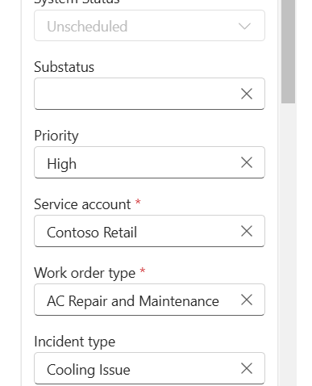

4.  Select **Create** to create the work order.

> 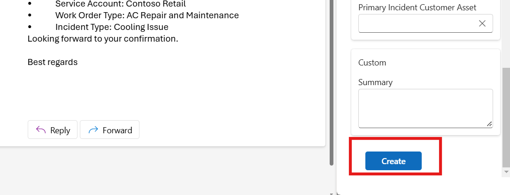

## Exercise 4 - Draft an email response with Copilot

1.  While you're viewing an email, open the Field Service add-in.

2.  From an open work order, select **Draft email based on work order**.

> 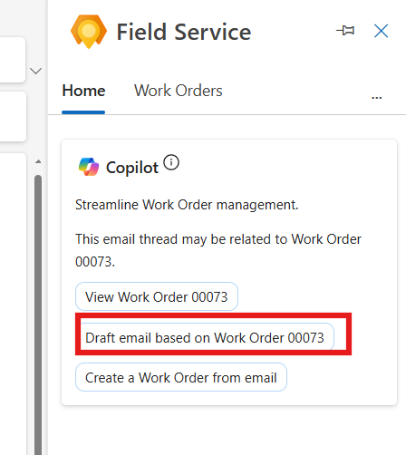

3.  Click on the **Proposed schedule**.

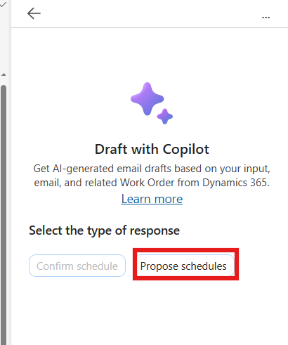

4.  Review the email draft and click on **Add to email.**

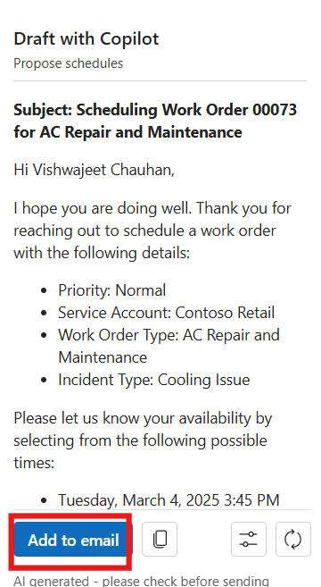

5.  After adding email click on the **Send** button.

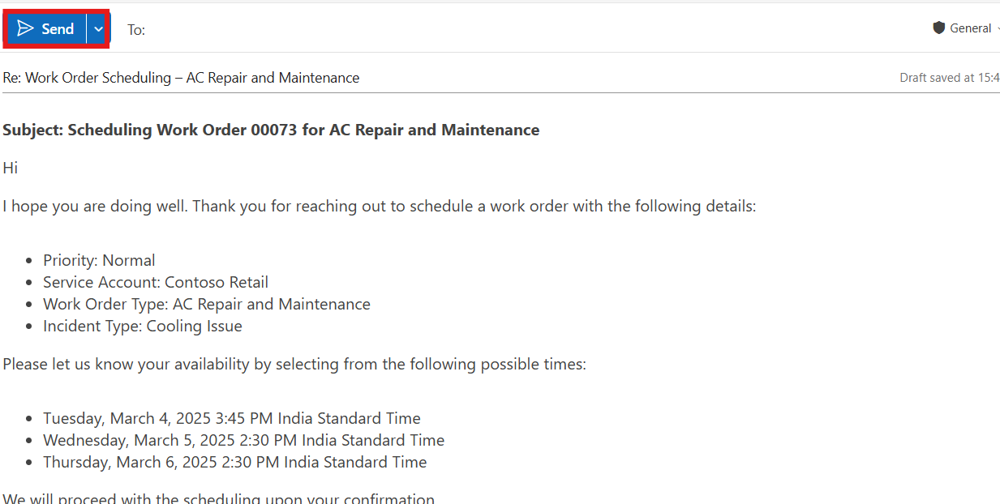

## Exercise 5 - View a work order

1.  While you're viewing an email, open the Field Service **add-in**, and
    then select the **Work orders** tab.

> 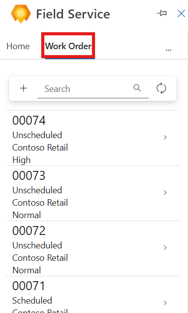

2.  In the search field enter the **work order number** in the field.

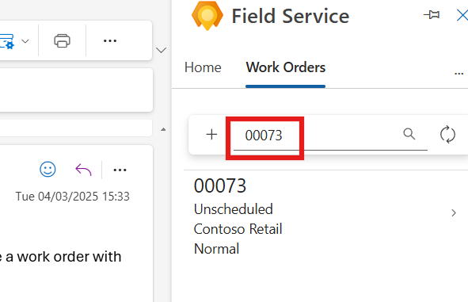

3.  Click on the **Work order** to see the details.

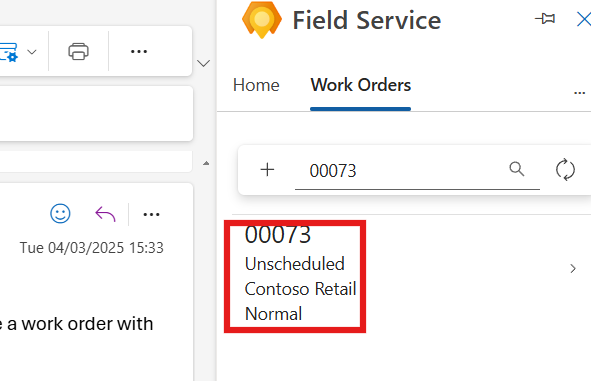

## Exercise 6 - Schedule or reschedule a work order

1.  View the work order you need to **schedule** or **reschedule**.

2.  To schedule, select **Schedule** under the suggested actions.

> 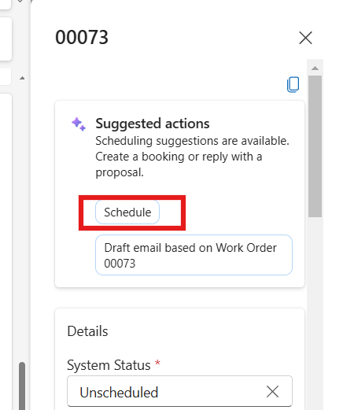

3.  Scroll down and click on the **Book Resource** button to a particular
    resource.

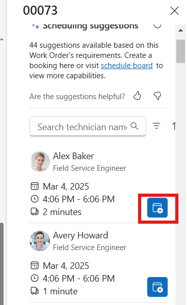

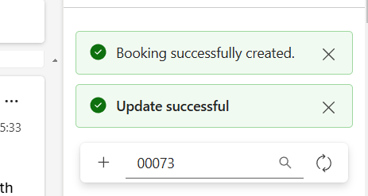

4.  To reschedule the work order, open a **schedule** work order.

> 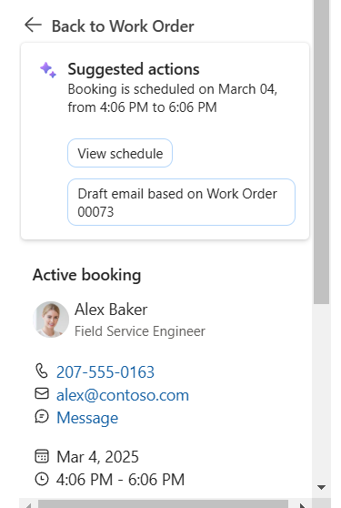

5.  Scroll down and click on the **Reschedule** button.

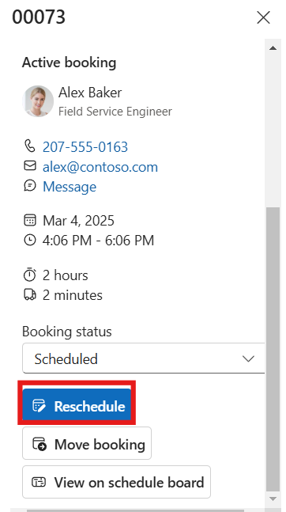

6.  Select the particular resource and click on the **Book Resource**
    button.

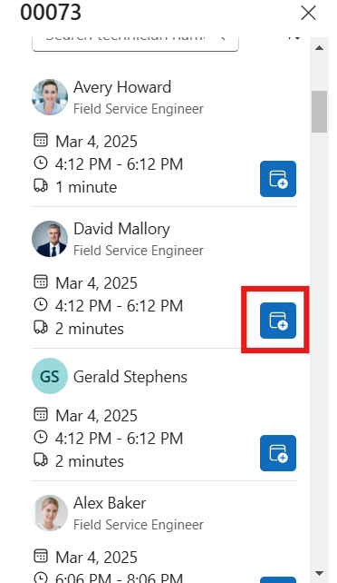

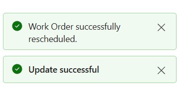

## Exercise 7 - Move a booking

If you don't need to change the assigned technician, just the date or
time of the service appointment, you can move the booking. If needed,
you can also assign the work order to a different resource.

1.  Open field service and search for the scheduled work order. Click on
    the **work order** to open the details.

> 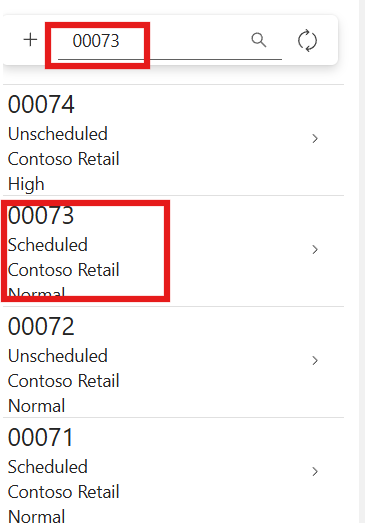

2.  View the work order and select **View schedule**.

> 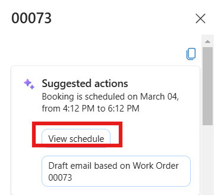

3.  Scroll down and select **Move booking**.

> 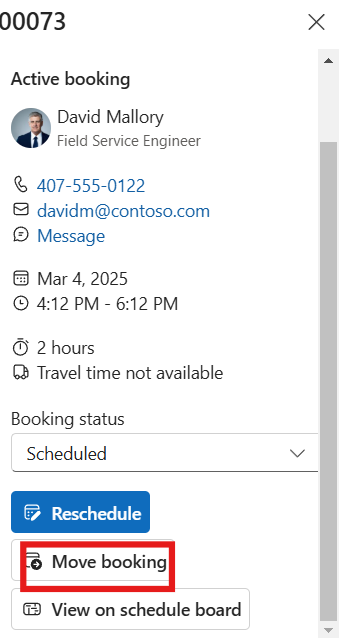

4.  Select the **new date and time** and, if needed a **different resource** also.

5.  Select **Update**.

> 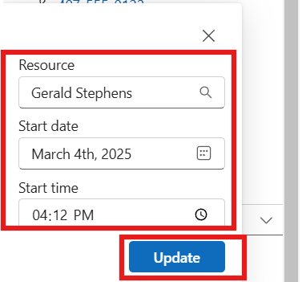

**Conclusion:**  
By completing this lab, you have successfully created and managed work
orders using the Field Service Outlook add-in and Copilot. You have
learned how to initiate work orders via email, utilize Copilot for
automation, manually create work orders, and schedule or reschedule
appointments. These skills will help enhance productivity, reduce manual
effort, and optimize field service operations. With this knowledge, you
can efficiently manage service requests and improve response times
within your organization.
