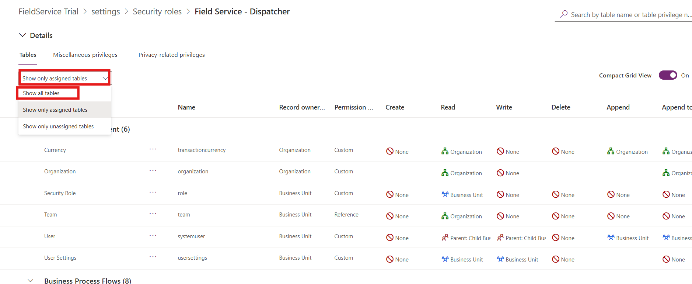
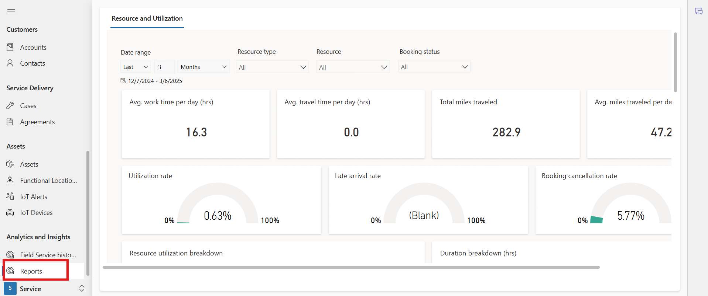

# Lab 8 - Explore Field Service real-time reports

**Estimated Time: 30 mins**

## Introduction

In this labs, explores real-time reports in Microsoft Dynamics 365 Field
Service. Participants will sign up for a trial, configure security roles
for report access, and analyze key metrics like resource utilization,
travel time, and work orders to enhance operational efficiency.

## Exercise 1: Sign up in the Microsoft Field Service

1.  Open the Edge browser and navigate to **Microsoft Dynamics 365** by
    visiting +++https://www.microsoft.com/en-in/dynamics-365/+++

2.  On the middle of the screen click on the **Try for free.**

3.  Locate **Dynamics 365 Field Service** and click on the **"Try for
    free"** button.

4.  In the *Let's get started* screen, enter the **M365 tenant** that
    were provided to you -as part of your lab environment. Accept the
    license agreement. (If you are prompted to enter a phone number, you
    can enter 0123456789.)

5.  Select **Start your free trial**. (If prompted, select **Launch
    Trial** in the pop-up.)

6.  If prompted enter the **M365 password** in the password field and
    click on the **Sign in** button. Your trial will launch. It may take
    a few minutes for your environment to open.

7.  Click on the **Cross** icon to close the what’s new window.

## Exercise 2 - Provide report access to a security role

1.  In Field Service, click on the settings from top and go
    to **Advanced Settings**.

2.  Go to **Security** under **System** section. Then click on the
    **Security Roles.**

3.  Scroll down and select the security role **Field Service – Dispatcher** that needs access to the reports.

4.  Select **Show all tables**.

5.  Scroll down and select **Field Service historical analytics**
    reports.

6.  Click on the **Permission** settings from top bar. Then, select the **Read**
    **privilege** for the report.

7.  Click on **Save and Close** from top bar.

## Exercise 3 - Explore Resource and utilization report

1.  To access the report, navigate to service area of field service and
    go to **Analytics and Insights** \> **Reports**.

  **Note:** Visualizations adapt to the filters and the listed formulas
  don't mention them specifically.

- **Avg. work time per day (hrs.)**: Average number of hours per day
  that the selected resources worked on bookings in the selected time
  range.

  Formula: (Total work time + Travel time) / Number of days

- **Avg. travel time per day (hrs.)**: Average number of hours per day
  that the selected resources spend traveling in the selected time
  range.

  Formula: Actual travel duration / Number of days

- **Total miles traveled**: Total miles traveled by the selected
  resources in the selected time range.

  Formula: Sum of miles traveled of the bookable resource bookings.

- **Avg. miles traveled per day**: Average number of miles traveled by
  the selected resources in the selected time range.

  Formula: Sum of miles traveled / Number of days

- **Utilization rate**: The percentage of time a resource spends on work
  and travel per [available time on the
  calendar](https://learn.microsoft.com/en-us/dynamics365/field-service/calendar-resource).

  Formula: ((Total work time + Travel time) / (Configured work hours per day x Number of days)) x 100

  **Note:** If the work hours aren't set on the calendar, the default is
  24 hours.

- **Late arrival rate**: The percentage of completed bookings where the
  technician arrived late.

  Formula: (Number of bookable resource bookings with late arrival /
  Total number of completed bookings) x 100

  **Note:** Being late is defined as arriving after the *Time to
  Promise* value. If *Time to Promise* isn't set, the *Estimated arrival
  time* is taken into account.

- **Booking cancellation rate**: The percentage of bookings with a
  canceled status that had a status of in progress or completed before.

  Formula: (Number of canceled bookable resource bookings / Total number
  of bookings) x 100

- **Resource utilization breakdown**: Percentage of time on work,
  travel, break, and idle time. Each bar in the chart shows the relative
  percentage of duration types in stacked columns. It doesn't show
  overtime values of any duration types. Available hours by day
  are [defined in the calendar for a
  resource](https://learn.microsoft.com/en-us/dynamics365/field-service/calendar-resource).

  Formula:

  - Work hour = (Total work time / (Available hours per day x Number of
    days)) x 100

  - Travel hour = (Actual travel time / (Available hours per day x Number
    of days)) x 100

  - Break hour = (Break time / (Available hours per day x Number of days))
    x 100

  - Idle hour = (((Available hours per day x Number of days) - Work hour -
    Travel hour - Break hour) / (Available hours per day x Number of
    days))) x 100

- **Duration breakdown**: Total work time, travel time, break time, and
  idle time. You can also drill in to the information to see specific
  information for in-progress jobs or completed jobs.

- **Bookings by territory**: List
  of territories as
  defined in the bookings with the number of bookings in each territory.

- **Variance to estimated travel time**: Variance between estimated
  travel times and actual travel times by territory.

  Formula: (Sum of actual travel time - Sum of estimated travel time) /
  Number of bookings

- **Miles traveled**: Shows the total miles traveled per month.

- **Requirement duration vs. allocated resource duration (% in hours)**:
  Gauge whether the total number of requirements in each territory is
  balanced with the total number of resources allocated to that
  territory. The resulting chart shows the percentage of the planned
  total duration versus the actual total duration.

  Formula: ((Total work time + Estimated travel duration) + (Total work
  time + Actual travel duration) / (Total work time + Estimated or
  actual travel duration)) x 100
  >

- **Correlation analysis (travel time and work time)**: Correlates each
  resource's travel time to work time and plots them in the matching
  quartile.

- **Resource metrics**: Shows the breakdown of KPIs for each resource,
  including number of bookings, utilization percentage, work time,
  travel time, break time, and idle time. Year over year (%) compares
  the resource utilization of the selected year to the year before.

## Exercise 4 – Explore Work order summary report 

1.  To access the Work order summary report, navigate to service area of
    field service and go to **Analytics and Insights** \> **Field
    Service historical analytics**.

  **Filters and slicers** 

  - **Date range**: A [relative date
    range](https://learn.microsoft.com/en-us/power-bi/visuals/desktop-slicer-filter-date-range). 

  - **Customer**: [Customer
    accounts](https://learn.microsoft.com/en-us/dynamics365/field-service/accounts) configured
    in Field Service. 

  - **System status**: [Booking status of a work
    order](https://learn.microsoft.com/en-us/dynamics365/field-service/work-order-status-booking-status). 

  - **Work order type**: [Work order
    types](https://learn.microsoft.com/en-us/dynamics365/field-service/create-work-order-types) in
    Field Service. 

  - **Substatus**: Custom substatuses related the booking status of a work
    order. 

  - **Service
    territory**: [Territory](https://learn.microsoft.com/en-us/dynamics365/field-service/set-up-territories) defined
    in Field Service. 

  - **Technician**: [Active bookable
    resources](https://learn.microsoft.com/en-us/dynamics365/field-service/set-up-bookable-resources) in
    Field Service. 

  

   

  - **Work orders**: Total number of work orders created for the selected
    filters. 

  - **Open work orders**: Total number of currently open work orders. 

  - **Broken promise (%)**: Percentage of work orders that weren't
    completed within the promise window. 

  - **Mean time to schedule (mins)**: Average time to schedule from the
    time the work order was created to the time of the first booking. 

  - **Mean time to travel (hrs)**: Average time taken by an agent to
    travel to the customer. Calculated for all non-agreement work orders. 

  - **Mean time to complete (hrs)**: Average time taken to complete all
    the bookings for a specific work order from the date the work order
    was created. 

  - **Avg. CSAT**: Average customer satisfaction rate. 

  - **Work orders by system status**: Number of work orders by status. 

  - **Work order trends by system status**: Work order status over time. 

  - **Work orders by substatus**: Number of work orders by substatus. 

  - **Work order trends by work order type**: Work order type over time. 

  - **Mean time to complete by work order type (mins)**: Average time to
    complete work order over time. 

  - **Work orders by primary incident type**: Number of work orders by
    primary incident type. 

- **Broken promise (%) by work order type**: Represents the correlation
  between broken promise percentage and work order type. 

- **Broken promise (%) vs mean time to schedule (mins)**: Correlation
  between broken promise percentage and average time to schedule in
  minutes. 

- **Broken promise (%) vs mean time to travel (hrs)**: Correlation
  between broken promise percentage and average travel time in hours. 

- **CSAT Trend**: Average customer satisfaction score (CSAT) value per
  month over time. 

- **CSAT by substatus**: Number of work orders with CSAT rating by
  substatus. 

- **Territory analysis**: Number of bookings
  by [territory](https://learn.microsoft.com/en-us/dynamics365/field-service/set-up-territories) on
  a map. The territory needs to be a physical geolocation to show on the
  map. 

## Conclusion

This lab guides users through signing up for Field Service, granting
report access, and exploring analytics on resource performance, work
order trends, and customer satisfaction. By the end, participants will
understand how to leverage Field Service reports for better
decision-making.
